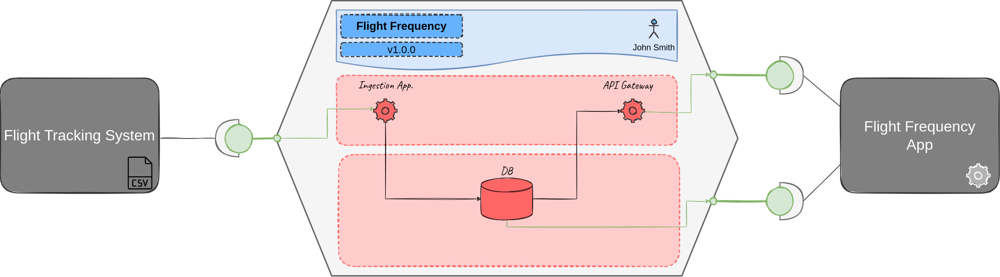

Open Data Mesh Demo
==============

Table of Contents
=================

* [Open Data Mesh Demo](#open-data-mesh-demo)
* [Table of Contents](#table-of-contents)
* [Overview](#overview)
* [Flight Frequency Data Product](#flight-frequency-data-product)
   * [Ports](#ports)
   * [Datastore API Interface](#datastore-api-interface)
   * [OpenAPI Interface](#openapi-interface)
* [Lifecycle](#lifecycle)
   * [Configure the Lifecycle block](#configure-the-lifecycle-block)
* [Flight Frequency Data Product - Publish &amp; Validation Phase](#flight-frequency-data-product---publish--validation-phase)
   * [Publish and Validate](#publish-and-validate)
* [Flight Frequency Data Product - Deployment Phase](#flight-frequency-data-product---deployment-phase)
   * [Start Infrastructure Provisioning Activity](#start-infrastructure-provisioning-activity)
   * [Start Application Deployment Activity](#start-application-deployment-activity)
* [Test Flight Frequency Data Product Interfaces](#test-flight-frequency-data-product-interfaces)
* [Cleanup](#cleanup)
* [Who do I talk to?](#who-do-i-talk-to)

<!-- Created by https://github.com/ekalinin/github-markdown-toc -->


# Overview
In this demo, we will illustrate how to manage the key phases of a Data Product's lifecycle, from the publishing and validation phase to the release phase, leveraging the features of the [Open Data Mesh Platform](https://initiative.opendatamesh.org/).

You can find the details of the specification that describes the Data Product for this demo [in this guide](https://dpds.opendatamesh.org/overview/).

# Flight Frequency Data Product
The Flight Frequency Data Product exposes information about the flight frequency for a series of air routes. This information can be queried using the output ports provided by the data product.



## Ports
The Flight Frequency Data Product consists of two output-ports with their respective specification and data contracts.

## Datastore API Interface
In the following snippet, the *flight_frequency_db* output port is represented, which utilizes the Datastore API to expose an SQL interface that can be queried via JDBC.

```
{
    "fullyQualifiedName": "urn:org.opendatamesh:dataproducts:flightfrequency:1:outputports:flight_frequency_db",
    "entityType": "outputport",
    "name": "flight_frequency_db",
    "version": "1.0.0",
    "displayName": "flight-frequency-db",
    "description": "Target database for airlines data. MySQL database.",
    "promises": {
       "platform": "westeurope.azure::mysql",
       "serviceType": "datastore-services",
       "api": {
          "name": "flightFrequencyApi",
          "version": "1.0.0",
          "specification": "datastoreapi",
          "specificationVersion": "1.0.0",
          "definition": {
            "mediaType": "text/json",
            "$ref": "dp-demo-v1.0.0-flight-freq-datastore-oport-api.json"
        },
          "externalDocs": {
             "description": "The OpenAPI v3.1.0 specification used to define the API of this port",
             "mediaType": "text/html",
             "$href": "https://spec.openapis.org/oas/v3.1.0"
          }
       },
       "deprecationPolicy": {
          "description": "When a new major version become available the previous one is kept online for 3 months",
          "x-deprecation-period": "3M"
       },
       "slo": {
          "description": "The slo are hight for all base service indicators because this service is business critical",
          "x-operationalSlo": {
             "availability": "0.99999",
             "responsetime": "1s"
          },
          "x-qualitySlo": {
             "freshness": "5m"
          }
       }
    }
 }
```

## OpenAPI Interface
Below is the snippet representing the *flight_frequency_restapi* output port, which exposes a REST API interface through which you can query data related to flight frequency.

```
{
    "fullyQualifiedName": "urn:org.opendatamesh:dataproducts:flightfrequency:1:outputports:flight_frequency_restapi",
    "entityType": "outputport",
    "name": "flight_frequency_restapi",
    "version": "1.0.0",
    "displayName": "flight_frequency_restapi",
    "description": "REST API to get airlines data.",
    "promises": {
       "platform": "westeurope.azure::vm",
       "serviceType": "rest-services",
       "api": {
          "name": "flightFrequencyRestApi",
          "version": "1.0.0",
          "specification": "restapi",
          "specificationVersion": "1.0.0",
          "definition": {
             "fullyQualifiedName": "urn:org.opendatamesh:dataproducts:flightfrequency:1:outputports:flight_frequency_restapi:top3flights",
             "name": "top3flights",
             "displayName": "top3flights",
             "description": "This port exposes top 3 frequent flights",
             "version": "1.0.0",
             "promises": {
                 "platform": "westeurope.azure:vm",
                 "serviceType": "rest-services",
                 "api": {
                     "name": "top3flights",
                     "version": "1.0.0",
                     "specification": "openapi",
                     "specificationVersion": "2.0.0",
                     "definition": {
                         "mediaType": "text/yaml",
                         "$ref": "dp-demo-v1.0.0-flight-freq-restapi-oport-api.json"
                     }
                 }
             }
         },
          "externalDocs": {
             "description": "The OpenAPI v3.1.0 specification used to define the API of this port",
             "mediaType": "text/html",
             "$href": "https://spec.openapis.org/oas/v3.1.0"
          }
       }
    }
 }
```

# Lifecycle
The descriptor of the Flight Frequency Data Product defines all the information about the data product, including those related to deploying the components necessary for its execution. This information is contained in the *lifecycleInfo* block.
The lifecycle block describes a series of activities, composed of one or more tasks, to be executed to deploy the data product's components.

In the Flight Frequency Data Product, two blocks of activities are defined:

* provisionInfraDev
* deployAppDev

The first represents the tasks to be performed to provision the infrastructure necessary for the data product.
The second represents the tasks to be performed for deploying the application within the infrastructure.


The next steps require having installed the Open Data Mesh Platform and configured the Azure environment. To do this, you can follow the steps described  [in this guide](https://github.com/data-engineering-helpers/data-contracts/blob/main/opendatamesh.org/quickstart/EnvironmentSetup.md).

## Configure the Lifecycle block
Open the **dp-demo-v1.0.0.json** file located in the **dp-demo-descriptor** folder and locate the *lifecycleInfo* block:

```
"lifecycleInfo":{
         "provisionInfraDev":[
            {
               "service":{
                  "$href":"azure-devops"
               },
               "template":{
                  "specification":"spec",
                  "specificationVersion":"2.0",
                  "definition":{
                     "organization":"[organizationName]",
                     "project":"[projectName]",
                     "pipelineId":"[pipelineID]",
                     "branch":"master"
                  }
               },
               "configurations":{
                  "params":{
                     "callbackBaseURL":"http://[IP]:8002/api/v1/pp/devops"
                  },
                  "stagesToSkip":[
                     
                  ]
               }
            }
         ],
         "deployAppDev":[
            {
               "service":{
                  "$href":"azure-devops"
               },
               "template":{
                  "specification":"spec",
                  "specificationVersion":"2.0",
                  "definition":{
                     "organization":"[organizationName]",
                     "project":"[projectName]",
                     "pipelineId":"[pipelineID]",
                     "branch":"master"
                  }
               },
               "configurations":{
                  "params":{
                     "callbackBaseURL":"http://[IP]:8002/api/v1/pp/devops"
                  },
                  "stagesToSkip":[
                     
                  ]
               }
            }
         ]
      }
```

Replace the following placeholders with the specific values from your Azure DevOps environment:

* [organizationName]: the name of your organization in Azure DevOps.
* [projectName]: the name of the project where you created the pipelines.
* [pipelineID]: the ID of the specific pipeline; for the **provisionInfraDev** block, insert the ID of the **odm-demo-infrastructure** pipeline, and for the **deployAppDev** block, insert the ID of the **odm-demo-application** pipeline.
* [IP]: enter the value used as the hostname in the configuration of the **odm-platform** SSH service connection.

# Flight Frequency Data Product - Publish & Validation Phase
The next step is to register the Flight Frequency Data Product in the Open Data Mesh platform.

## Publish and Validate
Open a terminal in the same folder as this README and execute the following commands, replacing the [IP] placeholder with the value used in the previous step.

1. The first step is to register some basic information about the Flight Frequency Data Product:

```
curl -X 'POST' \
  'http://[IP]:8001/api/v1/pp/registry/products' \
  -H 'accept: application/json' \
  -H 'Content-Type: application/vnd.odmp.v1+json' \
  -d "@dp-demo-descriptor/dp-demo.json"
```

2. Now, you can publish a new version of the Flight Frequency Data Product:

```
curl -X 'POST' \
  'http://[IP]:8001/api/v1/pp/registry/products/0979883d-dda1-36ab-8b1f-699e86158834/versions' \
  -H 'accept: application/json' \
  -H 'Content-Type: application/vnd.odmp.v1+json' \
  -d "@dp-demo-descriptor/dp-demo-v1.0.0.json"
```

If no errors arises, the Flight Frequency Data Product has been validated and published in the Open Data Mesh Platform, and we can begin managing its lifecycle.

# Flight Frequency Data Product - Deployment Phase
## Start Infrastructure Provisioning Activity
Let's start with the **provisionInfraDev** activity:

1. Register the activity:

```
curl -X 'POST' \
  'http://[IP]:8002/api/v1/pp/devops/activities' \
  -H 'accept: application/json' \
  -H 'Content-Type: application/vnd.odmp.v1+json' \
  -d "@dp-demo-descriptor/dp-demo-v1.0.0-activity-1.json"
```
2. Start the activity:

```
curl -X 'PATCH' \
  'http://[IP]:8002/api/v1/pp/devops/activities/1/status?action=START' \
  -H 'accept: application/json'
```

At this point, if you go back to your Azure DevOps, you should see the **odm-demo-infrastructure** pipeline running.

* Once the pipeline is complete, view the details of the **Terraform Apply** step and copy the IP found at the bottom of the execution log: **vm-public-endpoint**.
* Create a second SSH service connection as done [in this paragraph](####-ODM-Platform-deployment-instructions-####), specifying the following values:
    * Host name: enter the IP you just copied.
    * Port number: leave the default, 22.
    * Username: airline
    * Password: @1rl1n3D3m0!
    * Service connection name: odm-demo-airline
    * Check the option: Grant access permission to all pipelines.

## Start Application Deployment Activity
Now let's move on to the second and last activity of our Flight Frequency Data Product, **deployAppDev**:

* Register the activity:

```
curl -X 'POST' \
  'http://[IP]:8002/api/v1/pp/devops/activities' \
  -H 'accept: application/json' \
  -H 'Content-Type: application/vnd.odmp.v1+json' \
  -d "@dp-demo-descriptor/dp-demo-v1.0.0-activity-2.json"
```

* Start the activity:

```
curl -X 'PATCH' \
  'http://[IP]:8002/api/v1/pp/devops/activities/2/status?action=START' \
  -H 'accept: application/json'
```

At this point, if you go back to Azure DevOps, you should see the **odm-demo-application** pipeline running.

Once the pipeline is finished, you have completed the provisioning of the Flight Frequency Data Product, and you can start querying the exposed interfaces. 

# Test Flight Frequency Data Product Interfaces
As described initially, the Flight Frequency Data Product exposes two interfaces, a REST API to get flight frequencies, and a SQL access to query data on database.

* The REST API returns, for a specific airline code, the most frequent routes. You can execute this command to verify the interface (remember to replace the [IP] placeholder here with the value used in the previous step):

```
curl -X 'GET' \
  'http://[IP]:8080/api/v1/airline/2B/getTop3FrequentFlights' \
  -H 'accept: */*'
```

You should receive a response similar to this:

```
[
  {
    "airlineCode": "2B",
    "aptOrg": "VCE",
    "aptDst": "TIA",
    "fltFreq": 87
  },
  {
    "airlineCode": "2B",
    "aptOrg": "TIA",
    "aptDst": "VRN",
    "fltFreq": 87
  },
  {
    "airlineCode": "2B",
    "aptOrg": "TIA",
    "aptDst": "VCE",
    "fltFreq": 87
  }
]
```

The second one exposes a SQL interface (MySQLDB), which you can query using JDBC drivers. To connect, you can use, for instance, [DBeaver Community](https://dbeaver.io/) and the following information:

* DB Type: MySQL 8
* Hostname: Find the value within the **mysql-endpoint** parameter returned in the output by the **odm-demo-infrastructure** pipeline in the **Terraform Apply** step.
* Username: mysqladmin
* Password: @1rl1n3D3m0!


Congratulations 🎉 You have successfully deployed and tested your first data product!

# Cleanup
To delete all the resources created in this guide, navigate to the **infrastructure** folder and execute the following commands, replacing the placeholders with the values from the configuration used in this demo.

Note: You'll need to log in to the Azure CLI, configuring the environment used for this demo.

```
terraform init -reconfigure -backend-config=storage_account_name=[storage_account_name] -backend-config=container_name=[container_name] -backend-config=key=odm-platform/azuredevops.terraform.tfstate -backend-config=resource_group_name=[resource_group_name]

terraform destroy
```

Perform the same operations in the **odm-platform-infra** folder, replacing the placeholders where necessary.

```
terraform init -reconfigure -backend-config=storage_account_name=[storage_account_name] -backend-config=container_name=[container_name] -backend-config=key=airline-demo/azuredevops.terraform.tfstate -backend-config=resource_group_name=[resource_group_name]

terraform destroy
```

# Who do I talk to?

* Giandomenico Avelluto
* Quantyca S.p.A